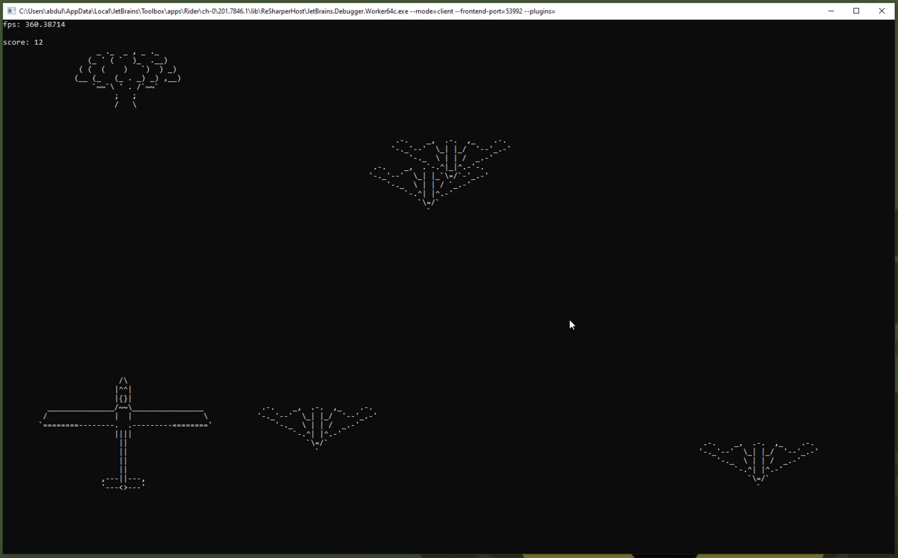

# Tergie
A simple, easy to use dot net framework for building games that run in a terminal window.

Written in C#.

# Example
~~~~~~~~~~~~~~~~~~~~~~~~~~~cs
public class Program
{
    public static void Main(string[] args)
    {
        // create a scene
        int sceneWidth = 120;
        int sceneHeight = 60;
        Scene scene = new Scene(sceneWidth,sceneHeight);
        
        // create an entity

        // first, create the graphics for the entity (just a 2d array of characters)
        char[,] graphics = new char[,]
        {
            {'x','x','x'},
            {'x','o','x'},
            {'x','x','x'},
        };

        // now create the entity
        Entity entity = new Entity(graphics);
        
        // add the entity to the scene
        scene.AddEntity(entity);

        // start the game (starts event/render loop)
        int windowWidth = sceneWidth;
        int windowHeight = sceneHeight;
        Game.Start(scene,windowWidth,windowHeight);
    }
}
~~~~~~~~~~~~~~~~~~~~~~~~~~~

# Demo/Tutorial Video
[https://youtu.be/KIZl1xTVVds](https://youtu.be/KIZl1xTVVds "demo/tutorial video")